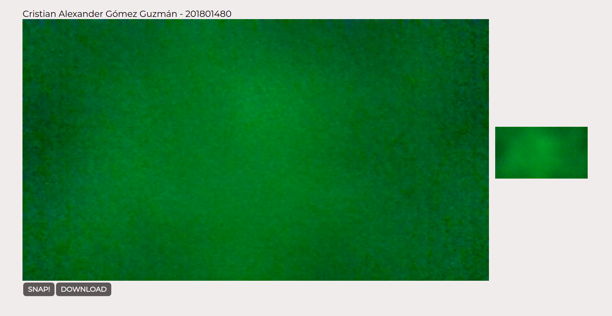

# Getting Started 
### `yarn start`

Runs the app in the development mode.\
Open [http://localhost:3000](http://localhost:3000) to view it in the browser.

# APP 

    

        
  

## Created by
[Cristian Gomez](https://github.com/cgomez29)